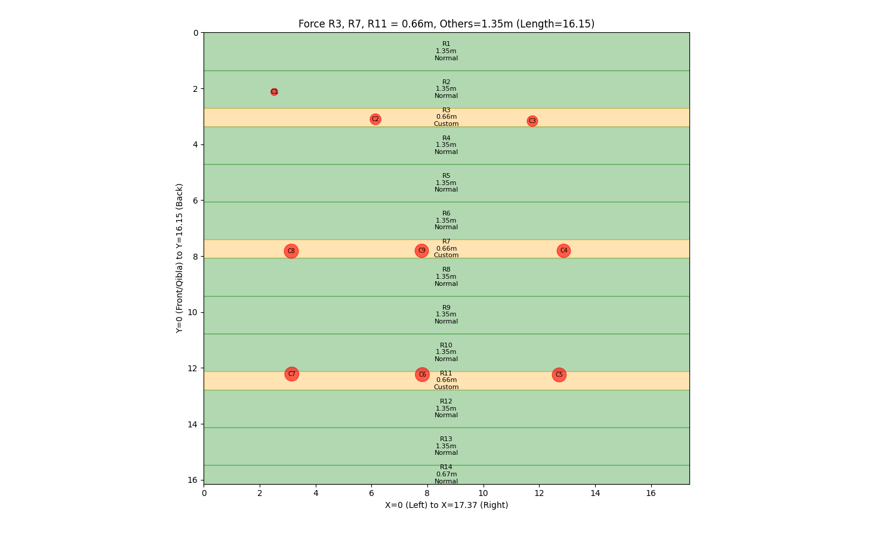
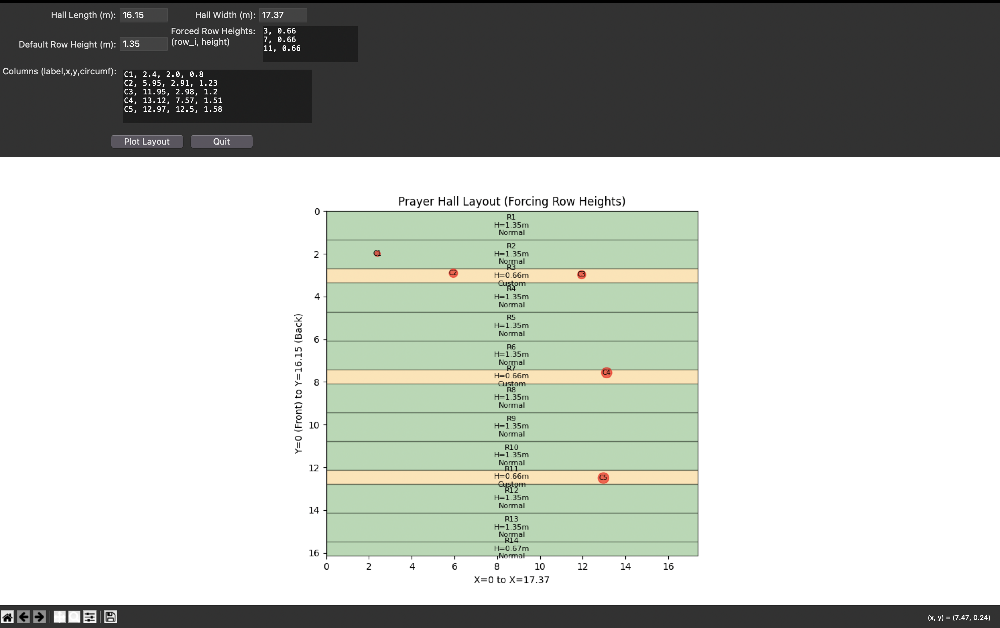

# Prayer Hall Carpet Layout Designer

## Overview
The **Prayer Hall Carpet Layout Designer** is a GUI tool that allows users to visualize and optimize **carpet layouts** in prayer halls. It helps determine the best carpet sizes while accommodating **columns and custom row heights**, making it an essential tool for mosque management, architects, and carpet suppliers.

## Features
- **Custom Row Heights**: Specify which rows should have different heights (e.g., 0.66m for rows near columns, 1.35m for normal rows).
- **Automatic Row Distribution**: Generates row layout within the hall’s given dimensions while respecting forced row heights.
- **Column Consideration**: Define **column positions (X, Y) and circumferences**, affecting row classifications (Normal or Custom).
- **Color-Coded Rows**:
  - **Green** → Normal carpet rows.
  - **Orange** → Custom carpet rows (when a row contains columns).
- **Matplotlib Integration**:
  - Zoom, Pan, Save the visualization via an embedded toolbar.
- **Simple User Input Fields**:
  - Define **Hall Length & Width**.
  - Set **Default Row Height**.
  - Input **Forced Row Heights**.
  - List **Columns** (Label, X, Y, Circumference).
- **Console Output**:
  - Summarizes row dimensions and column intersections.
  - Shows horizontal cutout details for custom carpets.

## Usage
### 1. Install Dependencies
```bash
pip install matplotlib numpy
```

### 2. Run the Application
```bash
python app.py
```

### 3. Input Data
- **Enter Hall Dimensions** (Length, Width).
- **Define Default Row Height** (e.g., 1.35m).
- **Specify Forced Row Heights** (e.g., row 3 = 0.66m, row 7 = 0.66m).
- **List Column Positions & Sizes** (X, Y, Circumference).
- **Click "Plot Layout"** to visualize the prayer hall carpet setup.

## Contributors
Developed by **Bryar Ghafoor**

## License
MIT License

## Example Screenshot


